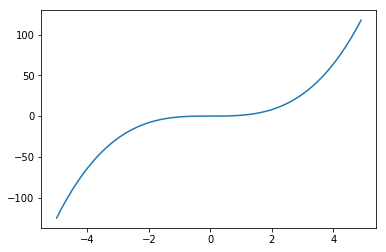
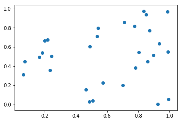
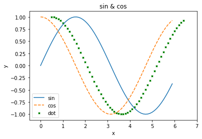

## Matplotlib

MatplotlibはPythonのグラフ描画のためのライブラリです。このハンズオンでは折線グラフや散布図を表示するために利用します。

Matplotlibを使う場合は以下のようにimportします。

```python
import matplotlib.pyplot as plt
```

### グラフの描画

#### 折れ線グラフの表示

Matplotlibで折れ線グラフを表示するには次のように記述します。

```python
import matplotlib.pyplot as plt
import numpy as np

x = np.arange(-5, 5, 0.1)
y = x**3

plt.plot(x, y)
plt.show()
```

実行結果は次のように表示されるでしょう。



ここではデータとしてNumpy配列 x、y を作成しています。次にplt.plotメソッドを呼び出して折れ線グラフを作成しています。
最後にplt.showメソッドを呼び出すとウィンドウが表示されます。

<div style="page-break-before:always"></div>


#### 散布図の表示

Matplotlibで散布図を表示するには次のように記述します。

```python
import numpy as np
import matplotlib.pyplot as plt

x = np.random.rand(30)
y = np.random.rand(30)

plt.scatter(x, y)
plt.show()
```

実行結果は次のように表示されるでしょう。



データとして、ランダムな要素を持つNumpy配列 x、 y を作成しています。
次にplt.scatterメソッドを呼び出して散布図を作成しています。

<div style="page-break-before:always"></div>


#### （参考）グラフのカスタマイズ

グラフには凡例（legend）を付けたり、x軸（y軸）に説明に説明を付けたり、様々なカスタマイズができるようになっています。

```python
import matplotlib.pyplot as plt
import numpy as np

x = np.arange(0, 6, 0.1)
y1 = np.sin(x)
y2 = np.cos(x)

plt.xlim(-0.5, 7) # グラフの表示範囲
plt.plot(x, y1, label="sin")
plt.plot(x, y2, label="cos", linestyle="--")
plt.scatter(x + 0.5, y2, s=10, label="dot", marker='x', color="green")
plt.xlabel("x")
plt.ylabel("y")
plt.title("sin & cos")
plt.legend() # データの凡例ラベル表示
plt.show()
```

実行結果は次のように表示されるでしょう。



プログラムの詳細を見てみましょう。

x軸、y軸の表示範囲を指定するには plt.xlim、ylim メソッドを使います。

```python
plt.xlim(-1, 2)
plt.ylim(-1, 2)
```

上記の場合、x軸、y軸ともに表示範囲が -1 から 2 までになります。


x軸、y軸の説明を追加するには plt.xlabel、ylabelメソッドを追加します。


```python
plt.xlabel("my x axis")
plt.ylabel("my y axis")
```


散布図の表示をカスタマイズするには、scatterメソッドの引数を指定します。

```python
plt.scatter(x, y, s=100, label="my data", marker='x', color="green")
```

ここではサイズに100を指定し、凡例用のラベルに"my data"、マーカーの形状に"x"、カラーに"green"をそれぞれ指定しています。また、データの凡例ラベル（"my data"）をグラフ上に表示するにはplt.legendメソッドを呼び出す必要があります。

```python
plt.legend()
```
